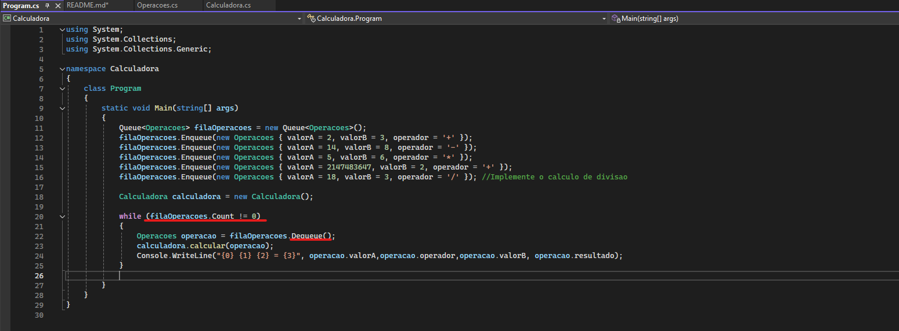
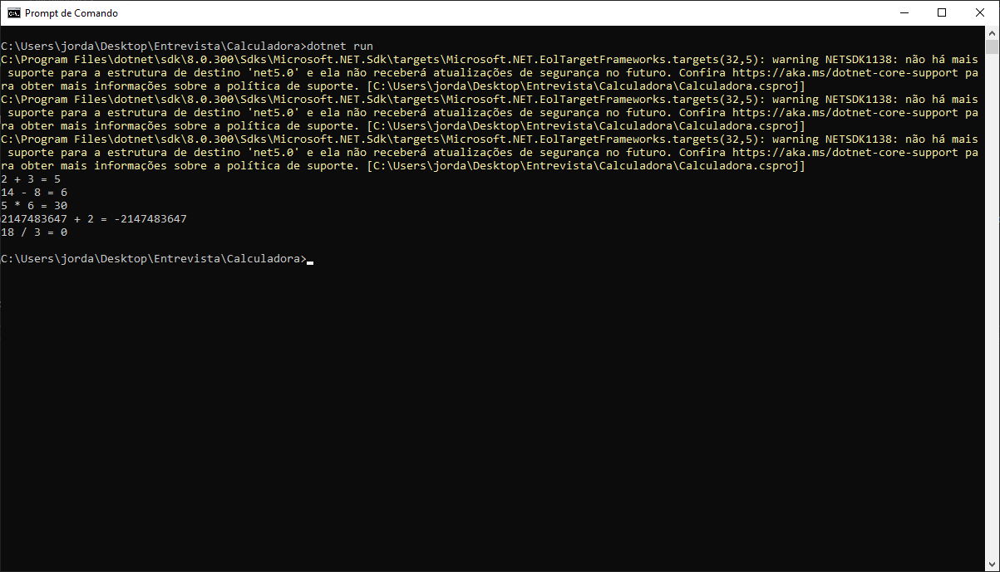
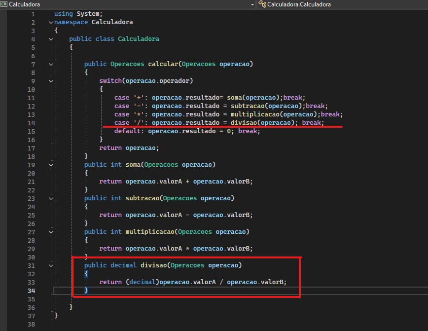
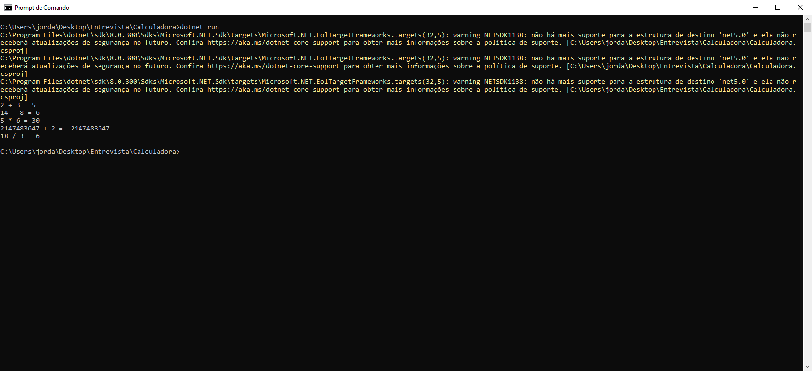
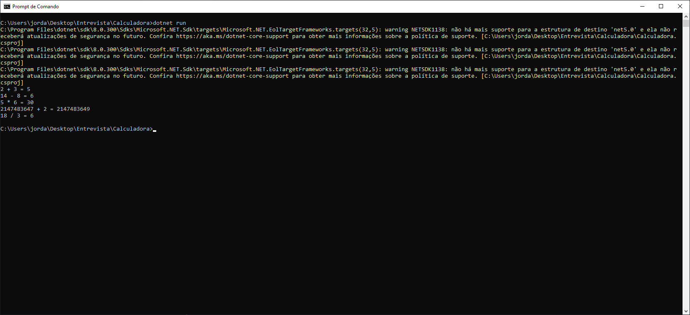
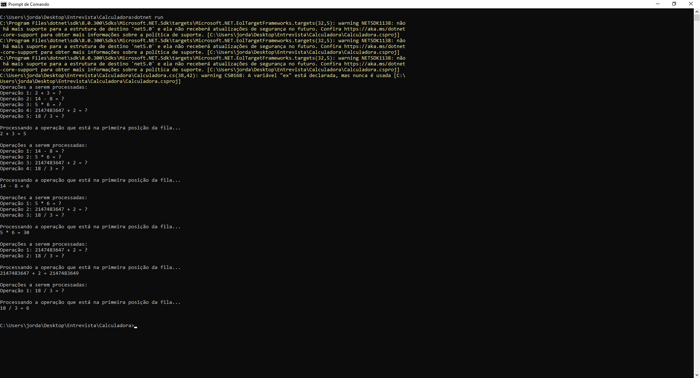
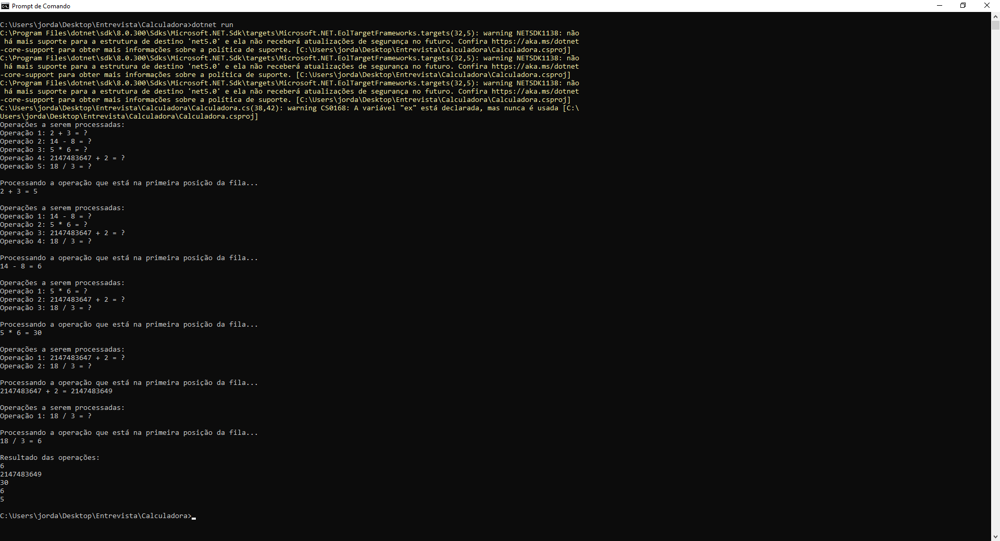

# Calculadora
Case para Engenharia de Software JR

Você precisa corrigir os seguintes problemas no codigo:
  1. Aplicação só está processando o primeiro item da fila infinitamente.
  2. Implemente a funcionalidade de divisão.
  3. Aplicação não está calculando a penultima operação corretamente.
     
     	Saída esperada no console:
     
     		14 - 8 = 6
     
     		5 * 6 = 30
     
     		2147483647 + 2 = 2147483649
     
     		18 / 3 = 6

  5. Implemente uma funcionalidade para imprimir toda a lista de operaçõoes a ser processada após cada calculo realizado.
  6. Crie uma nova pilha (Stack) para guardar o resultado de cada calculo efetuado e imprima a pilha ao final


Não existe resposta certa ou errada, o objetivo do case é avaliar a linha de raciocínio de cada candidato.
Você é livre para fazer na linguagem de sua preferência, desde que aplique as mesmas funcionalidades e tarefas deste case.
Dica: Utilize Visual Code ou Visual Studio Community para realizar as tarefas.

# Solução Exercicio 01

### Problema Inicial

A aplicação estava processando o primeiro item da fila infinitamente.

### Solução Implementada

Para resolver este problema, foi necessário editar o programa `Program.cs` em dois pontos:

1. **Correção da Condição do Loop**:
   - Na linha 20, substituímos `filaOperacoes.Count >= 0`, que roda enquanto o número de elementos na fila seja maior ou igual a zero, por `filaOperacoes.Count != 0`, ajustando a condição do `while` para interromper o loop quando o número de elementos na fila se tornar zero.

2. **Substituição de `Peek()` por `Dequeue()`**:
   - Na linha 22, substituímos `filaOperacoes.Peek()`, que obtém o elemento do topo da fila sem removê-lo, por `filaOperacoes.Dequeue()`, que também obtém o topo da fila, mas o remove.

Program.cs


Saída


# Solução Exercicio 02

### Problema Inicial

Implemente a funcionalidade de divisão.

### Solução Implementada

Para resolver este problema, foram realizadas as seguintes alterações no programa `Calculadora.cs`:

1. **Adição do Operador de Divisão**:
   - Na linha 14, foi incluído o seguinte código:
     ```csharp
     case '/': operacao.resultado = divisao(operacao); break;
     ```
   Isso permite que a calculadora reconheça o operador de divisão e execute a operação correspondente.

2. **Implementação do Método de Divisão**:
   - Na linha 31, foi adicionado um novo método para realizar a operação de divisão:
   ```csharp
    public decimal divisao(Operacoes operacao)
   {
       try
       {
           return (decimal)operacao.valorA / operacao.valorB;
       }
       catch (DivideByZeroException ex)
       {
           Console.Write("Erro: Tentativa de divisão por zero. -> ");
           return 0; 
       }
   }
     ```
   Este método calcula a divisão entre os dois valores fornecidos.

Com estas modificações, a funcionalidade de divisão foi devidamente implementada na calculadora.

Calculadora.cs


Saída


# Solução Exercicio 03

### Problema Inicial

Aplicação não está calculando a penúltima operação corretamente.

### Solução Implementada

Ao analisar a aplicação, identificamos que a penúltima operação não está sendo calculada corretamente. Isso ocorre devido ao uso do tipo `int`, que tem limitações quanto ao tamanho dos valores que pode armazenar. Dessa forma, basta alterar o tipo do resultado da operação de soma para `long`, permitindo lidar com intervalos maiores. Todavia, aproveitamos também a oportunidade para uniformizar o tipo das variáveis, optando pelo `decimal` para garantir precisão e flexibilidade em todos os cálculos, já que a variável resultado iniciou com este tipo.

Para resolver esse problema, fizemos as seguintes alterações nos arquivos `Calculadora.cs` e `Operacoes.cs`:

1. **Atualização do Tipo das Variáveis**: Alteramos o tipo das variáveis `valorA` e `valorB` de `int` para `decimal` no arquivo `Operacoes.cs`. Isso permite que a aplicação trabalhe com valores numéricos de forma mais precisa, sem se limitar ao intervalo restrito do tipo `int`.

```csharp
using System;
namespace Calculadora
{
    public class Operacoes
    {
        public decimal valorA {get;set;}
        public char operador { get; set; }
        public decimal valorB { get; set; }
        public decimal resultado { get; set; }

    }
}
```

2. **Refatoração dos Métodos**: Atualizamos os tipos de retorno dos métodos na classe `Calculadora.cs` de `int` para `decimal`. Essa alteração garante consistência e precisão nos cálculos realizados pela calculadora, pois todos os resultados agora são tratados como números decimais.

```csharp
  public decimal soma(Operacoes operacao)
  {
      return operacao.valorA + operacao.valorB;
  }
  public decimal subtracao(Operacoes operacao)
  {
      return operacao.valorA - operacao.valorB;
  }
  public decimal multiplicacao(Operacoes operacao)
  {
      return operacao.valorA * operacao.valorB;
  }
   public decimal divisao(Operacoes operacao)
{
    try
    {
        return (decimal)operacao.valorA / operacao.valorB;
    }
    catch (DivideByZeroException ex)
    {
        Console.Write("Erro: Tentativa de divisão por zero. -> ");
        return 0; 
    }
}
```

Com essas modificações, a aplicação agora é capaz de lidar com operações matemáticas de forma mais robusta, garantindo resultados precisos mesmo para valores numéricos grandes ou com casas decimais.

Saída


# Solução Exercicio 04

### Problema Inicial

Implemente uma funcionalidade para imprimir toda a lista de operações a serem processadas após cada cálculo realizado.

### Solução Implementada

Para resolver esse problema, foi criado um novo método chamado `ImprimirFilaOperacoes` em `Calculadora.cs` que imprime todas as operações que serão processadas em ordem. Esse método foi então chamado no `Program.cs` antes de chamar o método que processa a operação.

Program.cs
```csharp
while (filaOperacoes.Count != 0)
{
    calculadora.ImprimirFilaOperacoes(filaOperacoes);
    Operacoes operacao = filaOperacoes.Dequeue();
    Console.WriteLine("\nProcessando a operação que está na primeira posição da fila...");
    calculadora.calcular(operacao);
    Console.WriteLine("{0} {1} {2} = {3}\n", operacao.valorA,operacao.operador,operacao.valorB, operacao.resultado);
}
```

Calculadora.cs
```csharp
public void ImprimirFilaOperacoes(Queue<Operacoes> fila)
{
  int contagem = 1;
  Console.WriteLine("Operações a serem processadas:");
  foreach (var operacao in fila)
  {
      Console.WriteLine($"Operação {contagem}: {operacao.valorA} {operacao.operador} {operacao.valorB} = ?");
      contagem++;
  }
}
```

Saída


# Solução Exercicio 05

### Problema Inicial

Crie uma nova pilha (Stack) para guardar o resultado de cada calculo efetuado e imprima a pilha ao final.

### Solução Implementada

Para resolver o problema inicial, seguimos duas etapas:

1. No arquivo `Program.cs`, criamos uma pilha, adicionamos os resultados das operações a cada processamento e chamamos o método `ImprimirPilhaResultados` no final para que imprima os resultados.

Program.cs
```csharp
using System;
using System.Collections;
using System.Collections.Generic;

namespace Calculadora
{
    class Program
    {
        static void Main(string[] args)
        {
            Queue<Operacoes> filaOperacoes = new Queue<Operacoes>();
            // Criacao da pilha
            Stack<decimal> resultados = new Stack<decimal>();  
            filaOperacoes.Enqueue(new Operacoes { valorA = 2, valorB = 3, operador = '+' });
            filaOperacoes.Enqueue(new Operacoes { valorA = 14, valorB = 8, operador = '-' });
            filaOperacoes.Enqueue(new Operacoes { valorA = 5, valorB = 6, operador = '*' });
            filaOperacoes.Enqueue(new Operacoes { valorA = 2147483647, valorB = 2, operador = '+' });
            filaOperacoes.Enqueue(new Operacoes { valorA = 18, valorB = 3, operador = '/' });

            Calculadora calculadora = new Calculadora();

            while (filaOperacoes.Count != 0)
            {
                calculadora.ImprimirFilaOperacoes(filaOperacoes);
                Operacoes operacao = filaOperacoes.Dequeue();
                Console.WriteLine("\nProcessando a operação que está na primeira posição da fila...");
                calculadora.calcular(operacao);
                // adiciona os resultados na pilha
                resultados.Push(operacao.resultado);
                Console.WriteLine("{0} {1} {2} = {3}\n", operacao.valorA,operacao.operador,operacao.valorB, operacao.resultado);
            }
            // imprime os resultados que foram armazenados na pilha
            calculadora.ImprimirPilhaResultados(resultados);
        }

    }
}
```

2. No arquivo `Calculadora.cs`, criamos um novo método que imprime os resultados da pilha.

Calculadora.cs
```csharp
public void ImprimirPilhaResultados(Stack<decimal> resultados)
{
    Console.WriteLine("Resultado das operações:");
    foreach (var valor in resultados)
    {
        Console.WriteLine($"{valor}");
    }
}
```

Saída

